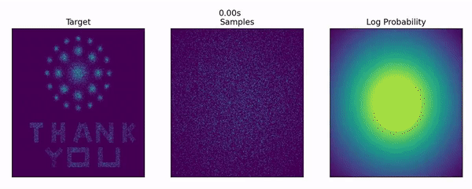

# Faster Training of Diffusion Models and Improved Density Estimation via Parallel Score Matching

Code for reproducing the experiments in the paper:

Etrit Haxholli, Marco Lorenzi. Faster Training and Improved Performance of Diffusion Models via Parallel Score Matching. 2023. [[hal-04032669]](https://inria.hal.science/hal-04032669/) 

Experiments where the diffusion time interval is separated into equal subintervals can be found in the folder 'Equal_subintervals'. In this folder one can also find the DPSM experiments.

Experiments where the diffusion time interval is separated into unequal subintervals can be found in the folder 'Unequal_subintervals'. This folder only contains TPSM experiments.

A visual presentation of the results of TPSM with equal separations on the 2D TY distribution is given below:

